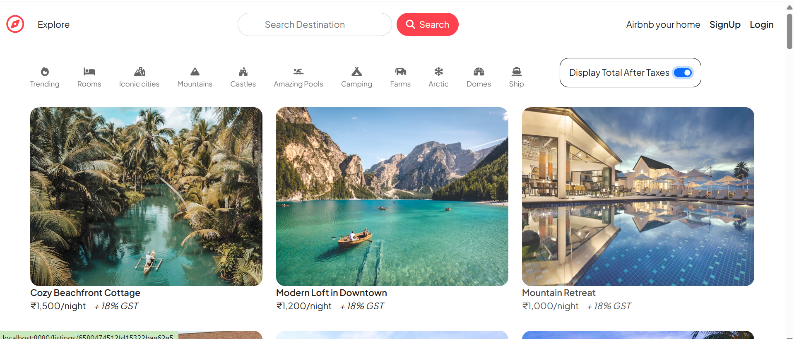

# 🏨 Wanderlust – Hotel Listing and Booking Platform

An end-to-end web application where users can explore, list, rent, and book hotels or homes. It integrates interactive maps, user reviews, and location-based services to provide a seamless experience for both hosts and travelers.

---

## 🚀 Features

- 🏠 Users can list their own hotels, homes, or rentals
- 🔍 Browse properties by location with integrated **Mapbox** api
- 📝 Comment and review system for guest feedback
- 📌 Interactive maps showing exact property locations
- 🌐 RESTful APIs for booking, listing, and reviewing properties

---

## 🖼️ Website Preview



---

## 🛠️ Tech Stack

| Technology | Purpose |
|------------|---------|
| HTML, CSS, JavaScript | Frontend |
| Node.js + Express.js  | Backend server & routing |
| MongoDB               | Database |
| Mapbox API            | Interactive Maps |

---

## 📦 Installation

```bash
git clone https://github.com/SafuraAnam/Wanderlust-Tourist-App.git
cd Wanderlust-Tourist-App
